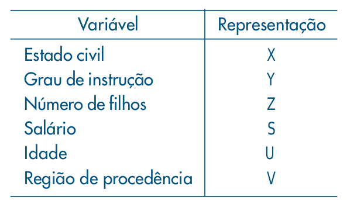
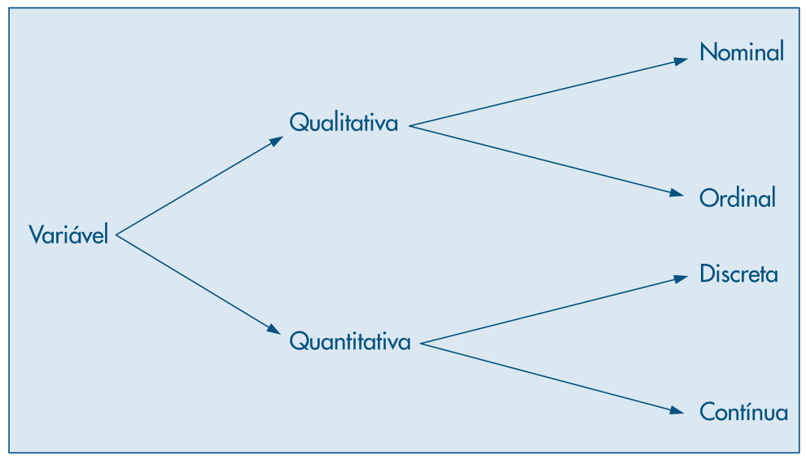

layout: true

<div class="my-footer"></div> 

---
name: indice

```{r setup, include=FALSE,warning=FALSE,message=FALSE}
options(htmltools.dir.version = FALSE)
knitr::opts_chunk$set(
    echo = FALSE,
    message = FALSE,
    warning = FALSE,
    dev = "svg",
    cache = TRUE,
    fig.align = "center"
    #fig.width = 11,
    #fig.height = 5
)

library(ggplot2)
library(ggthemes)
```

```{r dados}
load("../../dados/dados.RData")
```


# Índice

- [Resumo de Dados](#resumo)

- [Medidas-Resumo](#medidas)

- [Análise Bidimensional](#analise)

---
name: resumo

# Resumo de Dados

- Estatística trata de analisar e entender um ***conjunto de dados*** relevantes ao problema em estudo

- Esses dados foram de alguma forma coletados e são representativos de alguma população a ser estudada

- ***Inferência Estatística*** tem por objetivo a _coleta, tratamento, redução, análise e modelagem_ dos dados para, finalmente, fazer a inferência para a população

--

.center[Análise Estatística necessita de **DADOS**]

.center[

]

---
# Resumo de Dados

- Dados são organizados pelas características da população ao qual dizem respeito

- Chamamos estas características de ***variáveis*** e podemos coletar diversas ***observações*** destas

--

.center[]

---

# Resumo de Dados

- Variáveis podem ser classificadas em: ***qualitativas*** e ***quantitativas*** e subclassificadas em: ***nominal*** e ***ordinal*** e; ***discreta*** e ***contínua***

--

.center[
```{r , fig.align='center', out.width="70%"}

```
]

---

# Resumo de Dados

- Variáveis qualitativas (ou categóricas): apresentam como possíveis realizações uma qualidade (ou atributo) do indivíduo pesquisado

  + Exemplos: educação, estado civil

--

- Variáveis quantitativas: números resultantes de uma contagem ou mensuração

  + Exemplos: salário, idade

--

- Variáveis qualitativas **nominais**: não existe ordenação clara. Ex.: região de procedência

- Variáveis qualitativas **ordinais**: possuem ordenação. Ex.: grau de instrução

- Variáveis quantitativas **discretas**: conjunto finito ou enumerável. Ex.: núm. filhos

- Variáveis quantitativas **contínuas**: intervalo de números reais. Ex.: estatura, peso

---
name: medidas

# Medidas-Resumo

- Muitas vezes queremos resumir um conjunto de dados em apenas uma ou algumas métricas

- É importante que estas métricas sejam representativas do conjunto todo

--

- Neste curso trataremos de dois tipos de medidas-resumo:
  + Medidas de ***posição*** (ou localização)
  + Medidas de ***dispersão***

---
# Medidas de posição

- Resumo da posição do conjunto de dados. Valor central a partir do qual os dados estão distribuídos

--

- As três medidas de posição mais conhecidas são:
  + Moda
  + Mediana
  + Média

--

- **Moda** é a realização mais frequente dos dados. Pode haver mais de uma moda

- **Mediana** é o valor que ocupa a posição central da série de observações ordenadas

- **Média** é a soma das realizações divida pelo número destas

---

# Medidas de posição

## Exemplos

```{r exemp1}
tab1 <- data.frame(
    z = c(0, 1, 2, 3, 5),
    n = c(4, 5, 7, 3, 1)
)

n <- sum(tab1$n)
tab1f <- tab1
tab1f$f <- tab1$n / n

mean_z <- sum(tab1f$z * tab1f$f)
```

.pull-left[
```{r , results='asis'}
kbl1 <- kableExtra::kbl(tab1,
                col.names = c("N. filhos (Z)", "Frequência (N)")) |> 
    kableExtra::kable_classic(full_width = FALSE)
kbl1
```
]

--

.pull-right[
- Moda?

- Mediana?

- Média?
]

---

# Medidas de posição

## Média

- Seja $x_1, \ldots , x_k$, os valores distintos assumidos pela variável X

- $n_1, \ldots , n_k$ a quantidade de observações de cada um destes valores

- A **média aritmética** de X é:

$$\bar{x}=\frac{1}{n}\sum_{i=1}^kn_ix_i=\sum_{i=1}^kf_ix_i,$$
onde $n=\sum_{i=1}^k n_i$ e $f_i\equiv n_i/n$ é a frequência relativa da observação i

---

# Medidas de posição

## Mediana

- Considere as observações ordenadas em ordem crescente. A menor observação é $x_{(1)}$, portanto

$$x_{(1)}\leq x_{(2)}\leq \ldots \leq x_{(n)}$$
--
- Observações ordenadas são chamadas ***estatísticas de ordem***. Exemplos mais conhecidos são o **mínimo** $(x_{(1)})$ e o **máximo** $(x_{(n)})$

--
- A **mediana** pode assim ser definida:

$$\begin{equation}
md(X)=\begin{cases}
x_{\left(\frac{n+1}{2}\right)}, &\text{se n ímpar}\\
\frac{x_{\left(\frac{n}{2}\right)}+x_{\left(\frac{n}{2}+1\right)}}{2}, &\text{se n par}
\end{cases}
\end{equation}$$

---

# Medidas de dispersão

- Medidas de localização não informam sobre a variabilidade dos dados

- São necessárias medidas que sumarizem a variabilidade de um conjunto de observações

--
- Medidas de dispersão:
  + ***Desvio Médio***
  + ***Variância***
  
--
- Tomadas em relação a média

$$\begin{align*}
dm(X)&=\frac{\sum_{i=1}^n |x_i -\bar{x}|}{n},\\
var(X)&=\frac{\sum_{i=1}^n \left(x_i -\bar{x}\right)^2}{n}
\end{align*}$$

---

# Medidas de dispersão

Se houver repetição de observações

$$\begin{align*}
dm(X)&=\frac{\sum_{i=1}^k n_i|x_i -\bar{x}|}{n},\\
var(X)&=\frac{\sum_{i=1}^k n_i\left(x_i -\bar{x}\right)^2}{n}
\end{align*}$$

--

.pull-left[
```{r , results='asis'}
kbl1
```
]

--

.pull-right[
- Sabemos que $\bar{x}=$ `r mean_z`

- Qual $dm(Z)$?

- Qual $var(Z)$?
]

---

# Medidas de dispersão

- Variância tem unidade igual ao quadrado da unidade original dos dados!

- Difícil interpretação

--

- Pode-se utilizar o ***desvio-padrão*** para voltar a unidade de medida original

$$dp(X)=\sqrt{var(X)}$$

---

# Quantis Empíricos

- Somente medidas de posição e dispersão podem não ser suficientes para descrever um conjunto de dados

- Da mesma forma que a **mediana** divide os dados ao meio (50%), podemos definir outra medida para dividir os dados

--

- Chama-se de ***quantil de ordem p*** ou p-quantil, $q(p)$, o valor tal que $100*p \%$ das observações sejam menores que $q(p)$

- Temos alguns quantis especiais:
  + $q(0,25)=q_1$: 1º **Quartil**
  + $q(0,50)=q_2$: mediana
  + $q(0,75)=q_3$: 3º **Quartil**

---

# Quantis Empíricos

- Exemplo: 2 < 3 < 5 < 7 < 8 < 10 < 11 < 12 < 15 

--
- Temos um número ímpar de observações. Portanto a mediana $(q_2)=8$

- Como calculamos os quartis $q_1$ e $q_3$ ?

--

- Temos de dividir os dados em 4 partes. Já fizemos em duas

- Quartil $q_1$: tome a primeira metade, 2 < 3 < 5 < 7 e encontre a mediana desta

- Quartil $q_3$: o mesmo para a segunda metade

---

# Quantis Empíricos

- Uma propriedade dos quantis empíricos é que são ditos ***medidas robustas*** de posição

- A robustez é no sentido que estas medidas são pouco afetadas por valores discrepantes nos dados

--

- Considere o exemplo anterior: 2 < 3 < 5 < 7 < 8 < 10 < 11 < 12 < 15

- Mediana = 8 e Média = 8,1

--

- Se acrescentarmos o valor 67 na série
  + Mediana = 9
  + Média = 14!!

--

.center[`r emo::ji("point_right")` **Média é sucetível a _outliers_** `r emo::ji("warning")`] 

---

# Box Plots

- Representação gráfica de importantes quantis de um conjunto de dados

- Em um _box plot_ consegue-se visualizar a posição, dispersão, assimetria, caudas e dados discrepantes

- A caixa é formada pelos 1º e 3º quartis, com a mediana cortando a caixa

- Os limites superior e inferior são calculados da seguinte forma:

$$\begin{align*}
LS = q_3 + 1,5*d_q\\
LI = q_1 - 1,5*d_q
\end{align*}$$

onde $d_q = q_3 - q_1$ é chamado de ***distância interquartil***

---

# Box Plots

Vejamos o _box plot_ do exemplo com 30 municípios brasileiros

--

.pull-left[
```{r , results='asis'}
set.seed(876999)
df <- cd_municipios[sample(2:29, 10) |> sort(), 2:3]
kableExtra::kbl(df,
                col.names = c("Município", "População")) |> 
    kableExtra::kable_classic(full_width = FALSE)
```
]

.pull-right[
```{r boxplot, out.height=400}
ggplot(df, aes(y = populacao)) +
    geom_boxplot(color = "darkgreen") +
    labs(y = "População",
         title = "Municípios Brasileiros") +
    theme_few()
```
]

---

# Histogramas

***Histograma*** é um gráfico de barras contíguas, com as bases proporcionais aos intervalos das classes e a área de cada retângulo proporcional à respectiva frequência.

- As classes podem vir diretamente de uma variável qualitativa, ou;

- Variáveis quantitativas devem ter as classes construídas com intervalos

--

Vejamos um exemplo com dados de temperatura

---

# Histogramas

.pull-left[
- Temos 120 observações de temperatura da cidade de Ubatuba-SP

- Histograma é um gráfico **univariado**

- Criamos intervalos para a variável contínua de temperatura
]

--

.pull-right[
```{r }
ggplot(cd_temperaturas, aes(x = ubatuba)) +
    geom_histogram(fill = "darkgreen", 
                   color = "white",
                   binwidth = 2) +
    scale_x_continuous(n.breaks = 10) +
    labs(x = "Temperatura ºC",
         y = "Contagem",
         title = "Temperaturas em Ubatuba-SP") +
    theme_few()
```
]

---
name: analise

# Análise Bidimensional

- Até o momento análisamos as propriedades de apenas uma variável por vez

- Frequentemente desejamos avaliar o **comportamento conjunto** de duas ou mais variáveis

- Coletamos mais de uma variável em cada observação (i.e. de um indivíduo)

- Organizamos em uma tabela (_Data Frame_ no R)

--

```{r , results='asis'}
kableExtra::kbl(tab2_1[1:5, ]) |> 
    kableExtra::kable_classic(full_width = FALSE)
```

---

# Análise Bidimensional

- Quando consideramos duas variáveis, podemos ter três situações:
  + as duas variáveis são qualitativas;
  + as duas variáveis são quantitativas; e
  + uma variável é qualitativa e outra é quantitativa.
  
- Dependendo da situação, a técnica de análise será diferente

--

- Duas qualitativas: tabela de contingência com as frequências

```{r , results='asis'}
kableExtra::kbl(xtabs(~estado_civil+grau_instrucao, data = tab2_1)) |> 
    kableExtra::kable_classic(full_width = FALSE)
```

---

# Análise Bidimensional

.pull-left[
- Duas variáveis quantitativas 

- _scatter plot_, 

- correlação, 

- regressão

]

--

.pull-right[
```{r , out.height=500}
ggplot(tab2_1, aes(x = idade_anos, y = salario)) +
    geom_point(color = "darkgreen") +
    geom_smooth(formula = "y~x",
                method = "lm", 
                se = FALSE) +
    labs(x = "Idade", 
         y = "Salário") +
    theme_few()
```
]

---

# Análise Bidimensional

.pull-left[
- Quando temos uma variável **qualitativa** e outra **quantitativa**

- Analisamos o que acontece com a variável quantitativa quando os dados são categorizados de acordo com a variável qualitativa.
]

--

.pull-right[

```{r , out.height=500}
ggplot(tab2_1, aes(x = estado_civil, y = salario, color = estado_civil)) +
    geom_boxplot() +
    guides(color = guide_legend(title = "Estado Civil")) +
    labs(x = "Estado Civil", 
         y = "Salário") +
    theme_few()
```
]

---

# Análise Bidimensional

- Entendemos a ***associação*** de duas variavéis como 

> a mudança de opinião sobre o comportamento de uma variável na presença ou não de informação sobre a segunda variável

--

- `r emo::ji("warning")` Este conceito de "mudança de opinião" condicional em alguma informação será exaustivamente explorado neste curso!
