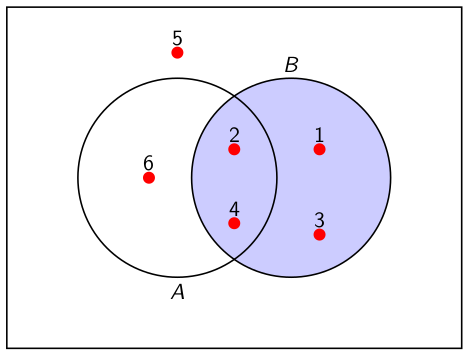
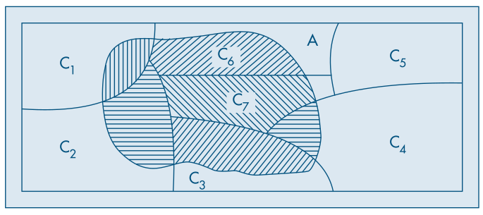
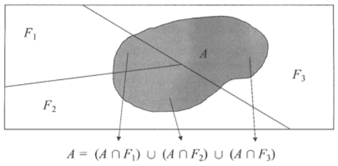

layout: true

<div class="my-footer"></div> 

---
name: indice

```{r setup, include=FALSE,warning=FALSE,message=FALSE}
options(htmltools.dir.version = FALSE)
knitr::opts_chunk$set(
    echo = FALSE,
    message = FALSE,
    warning = FALSE,
    dev = "svg",
    cache = TRUE,
    fig.align = "center"
    #fig.width = 11,
    #fig.height = 5
)

library(ggplot2)
library(ggthemes)
```

```{r dados}
load("../../dados/dados.RData")
```


# Índice

- [Introdução](#introducao)

- [Exercícios 1](#exercicios1)

- [Probabilidade Condicional](#condicional)

- [Exercícios 2](#exercicios2)

- [Independência](#independencia)

- [Exercícios 3](#exercicios3)

- [Teorema de Bayes](#bayes)

- [Exercícios 4](#exercicios4)


---
name: introducao

# Introdução

***Fenômenos determinísticos***

Dizemos que um experimento é determinístico quando repetido inúmeras
vezes, em condições semelhantes, conduz a resultados essencialmente
idênticos. Ex.:
- Aceleração da gravidade;
- Leis da Física e da Química.

--

***Fenômenos aleatórios***

Os experimentos que repetidos sob as mesmas condições geram
resultados diferentes, são chamados de experimentos aleatórios. Ex.:
- Lançamento de uma moeda;
- Lançamento de um dado;
- Condições climáticas do próximo domingo;
- Taxa de inflação do próximo mês.

---
# Teoria das Probabilidades

- O que é a Teoria das Probabilidades?
  + Ramo da matemática que desenvolve e avalia **modelos** para descrever
**fenômenos aleatórios**.
  + É a base teórica para o desenvolvimento das técnicas estatísticas.

- Qual o objetivo da Teoria das Probabilidades?
  + Construir um arcabouço **matemático** adequado para descrever
fenômenos aleatórios.

- O que precisamos para começar?
  + Descrever o **conjunto de resultados possíveis** do fenômeno aleatório
de interesse;
  + Atribuir **pesos** a cada possível resultado, refletindo suas chances de
ocorrência.

---
#Definições

- ***Espaço amostral***: Conjunto de todos os possíveis resultados de um
experimento aleatório.
  - Pode conter um número finito ou infinito de pontos.
  - Exemplos: $\{cara, coroa\}$, $\{1,2,3,4,5,6\}$, $\mathbb{R}^+$.
  - Notação $\Omega$.

- ***Pontos amostrais***: São os elementos que compõem $\Omega$.
  - Notação $\omega$.
  - Exemplo: $\omega_1$ = cara, $\omega_2$ = coroa.

- ***Eventos***: Todo resultado ou subconjunto de resultados de um experimento aleatório.
  - Exemplos: A = “sair cara”, B = “sair face par”.
  - Em geral são denotados por $A, B, C, \ldots$ 
  
---
# Exemplos

> - **Experimento**: pesar um fruto ao acaso.

> - **Espaço amostral**: $\Omega = \mathbb{R}^+$.
 
> - **Pontos amostrais**: espaço amostral é infinito. $\omega\in [0,\infty)$
 
> - **Eventos**: A = “peso menor que 50g”, $B = \{x \mid x \geq 100g\}$.

--

<br>
> - **Experimento**: lançar um dado de seis faces.

> - **Espaço amostral**: $\Omega = \{1,2,3,4,5,6\}$.

> - **Pontos amostrais**: $\omega_i = i, \text{ onde } i\in \{1,2,3,4,5,6\}$

> - **Eventos**: A = sair número par, B = sair número menor que 3.


---

# Teoria de Conjuntos

.pull-left[
Um conjunto é uma reunião de ***elemetos***

$A=\{0, 2, 4\}$, ou $B=\{`r emo::ji('warning')`, `r emo::ji('up')`, `r emo::ji('glass')`\}$

- Operações sobre conjuntos
  + ***União***: $A\cup B=\{x\,\mid\, x \in A \textbf{ ou } x \in B\}$
  + ***Interseção***: $A\cap B=\{x\,\mid\, x \in A \textbf{ e } x \in B\}$
  + ***Complementação***: $A^c$ ou $\bar{A}=\{x\in S\,\mid\, x \notin A\}$. onde $A\subset S$

- ***Conjunto vazio***, denotado por $\emptyset$
- ***Disjuntos*** (mutuamente exclusivos), $A\cap B = \emptyset$
]

--

.pull-right[
<br>
<br>
<br>

| Símbolo       | Significado        |
|---------------|--------------------|
| $=$           | Igual              |
| $\in$         | Pertence           |
| $\cup$ $\cap$ | União / Interseção |
| $\subset$     | Está contido       |
| $\mid$ ou $:$ | Tal que            |
| $\exists$     | Existe             |
| $\forall$     | Para todo          |

]

---
# Exemplo

Considere o lançamento de um dado e os eventos: $A = \{1, 2, 3, 4\}$,
$B = \{\omega : \omega \geq 3\}$, C = face par, D = face primo.

- Quem são $A, B, C \text{ e } D$?

--

- $A\cup D$, 
- $C\cap D$ e, 
- $B^c \cap A$?

---
# Teoria de Conjuntos

## Propriedades

1. Para todo conjunto A, $\emptyset \subset A$
1. $A\cup B = B\cup A$ - Comutatividade
1. $A\cap B = B\cap A$
1. $A\cup(B\cup C) = (A\cup B)\cup C$ - Associatividade
1. $A\cap(B\cap C) = (A\cap B)\cap C$
1. $A\cap(B\cup C) = (A\cap B)\cup (A\cap C)$ - Leis Distributivas
1. $A\cup(B\cap C) = (A\cup B)\cap (A\cup C)$
1. $(A\cup B)^c=A^c\cap B^c$ - Leis de DeMorgan
1. $(A\cap B)^c=A^c\cup B^c$

---

# Diagramas de Venn

Uma forma gráfica simples de representar conjuntos e suas operações

- Suponha um espaço amostral $S$ e dois subconjuntos $A$ e $B$

.pull-left[
```{r venn, out.height=400}
plt <- venn::venn(2, ggplot = TRUE, 
                  zcolor = c("darkgreen", "blue")) +
    annotate("text", x = 50, y = 950, label = "S")

plt
```
]

--

.pull-right[
- $A\cup B$ ?

- $A\cap B$ ?

- $S\backslash(A\cup B)$ ? (mesmo que $(A\cup B)^c$)
]

---

# Axiomas de Probabilidade

Probabilidade é uma função $P(\cdot)$ que atribui valores numéricos aos eventos do espaço amostral, de tal forma que

1. $0 \leq P(A) \leq 1$, $\forall A \subset \Omega$;
1. $P(\Omega) = 1$;
1. $P(\bigcup_{j=1}^n A_j) = \sum^n_{j=1} P(A_j)$, com os $A_j$ disjuntos.

--

Estas três propriedades são conhecidas como **Axiomas de Kolmogorov**

--

A pergunta que surge é: como **atribuir probabilidades** de ocorrência aos elementos do espaço amostral?

---

# Definição de Probabilidade

Existem duas maneiras principais de atribuir probabilidades aos elementos
do espaço amostral:

1. **Clássica**. Baseia-se nas ***características teóricas*** do fenômeno.
  - Considerando o lançamento de um dado, temos $\Omega = \{1, 2, 3, 4, 5, 6\}$.
  - Admitindo que o dado é honesto, podemos assumir que $P(1) = P(2) = \ldots = P(6) = 1/6$

--

2. **Frequentista**. Baseia-se nas ***frequências relativas*** de ocorrência do
fenômeno. Empírica.
  - Determinar a probabilidade de ocorrência de cada face de um dado.
  - Sem fazer nenhuma suposição inicial, podemos usar as frequências relativas de sucessivas ocorrências.

---

# Definição Frequentista

Repetir o experimento aleatório $n$ vezes e contar o número de ocorrência do evento A, $n(A)$

- Frequência relativa: $f_{A,n}=n(A) / n$

--

Se pudermos repetir o experimento um grande número de vezes, $n\rightarrow\infty$, então

$$\lim_{n\rightarrow\infty}\frac{n(A)}{n}=P(A)$$

---
# Exemplo
## Definição Clássica

Lançamos uma moeda duas vezes. C indica cara e R indica coroa. O espaço amostral será
$$\Omega = \{\omega_1 , \omega_2 , \omega_3 , \omega_4 \}$$
onde $\omega_1 = (C, C ), \omega_2 = (C, R), \omega_3 = (R, C ), \omega_4 = (R, R)$. 

Suponha que cada ponto $\omega_i$ tenha probabilidade 1/4. (moeda não viciada)

Seja A o evento que consiste na obtenção de faces iguais nos dois
lançamentos, então

--

$$P(A) = P(\omega_1 \text{ ou } \omega_4) = 1/4 + 1/4 = 1/2.$$

--

De modo geral, se A for qualquer evento de $\Omega$, então

$$P(A ) = \sum_{\omega_j\in A}P(\omega_j)$$

---

# Exemplo
## Definição Frequentista

Lançamos um dado n vezes e contamos o número de ocorrências do valor 4. A medida que $n\rightarrow\infty$ o valor **estimado** da probabilidade $P(4)$ tende para o verdadeiro valor, 1/6.

.pull-left[

```{r p4, echo = TRUE}
n <- seq(10, 10000, by = 10)
p4 <- sapply(n, function(n) {
    (sample(1:6, n, replace = TRUE) == 4) |> 
        mean()
})
df <- data.frame(n, p4)
plt <- ggplot(df, aes(n, p4)) +
    geom_line() +
    geom_hline(yintercept = 1/6, 
               linetype = "dashed", 
               color = "red") +
    theme_clean()
```
]

.pull-right[
```{r , out.height=370}
plt
```
]

---

# Eventos como Conjuntos

Eventos e o próprio espaço amostral são encarados como conjuntos e, portanto, possuem propriedades análogas aos conjuntos, por exemplo:

.pull-left[

1. $(A \cap B)^c = A^c \cup B^c$
1. $(A \cup B)^c = A^c \cap B^c$
1. $A \cap \emptyset = \emptyset , A \cap \Omega = A$
1. $\emptyset^c = \Omega, \Omega^c = \emptyset$
1. $A \cap A^c = \emptyset$
1. $A \cup A^c = \Omega$
1. $A \cup \emptyset = A, A \cup \Omega = \Omega$
1. $A \cap (B \cup C) = (A \cap B) \cup (A \cap C )$

]

.pull-right[
1. $P(\emptyset)=0$
1. $P(A)\leq1$
1. $P(A^c)=1-P(A)$
1. $P(A\cup B)=P(A)+P(B)-P(A\cap B)$
1. $P(B\cap A^c)=P(B)-P(A\cap B)$
1. $P(A)\leq P(B)$ se $A\subset B$
1. $P(A)=\sum_{i=1}^n P(A\cap C_i)$, para qualquer partição $C_i$ de $A$
1. $P(\bigcup_{i=1}^\infty A_i)\leq\sum_{i=1}^\infty P(A_i)$
]

---

# Exemplos

Consideremos um experimento aleatório e os eventos A e B associados,
tais que $P(A) = 1/2$, $P(B) = 1/3$ e $P(A \cap B) = 1/4$. Calcule:

.pull-left[
- $P(A^c)$
- $P(A\cup B)$
- $P(A^c\cap B^c)$
- $P(A^c\cap B)$

]

--

.pull-right[
- $1-P(A)=1/2$
- $P(A)+P(B)-P(A\cap B)=7/12$
- $P((A\cup B)^c)=1-P(A\cup B)=5/12$
- $P(B)-P(A\cap B)=1/12$
]


Outra forma de resolver o último item

- $(A^c\cap B) \cup (A\cap B) = B$
- Logo $P(A^c\cap B) + P(A\cap B)=P(B)$
- $P(A^c\cap B)=P(B)-P(A\cap B)$

---
name: condicional

# Probabilidade Condicional

- Em muitas situações práticas, o fenômeno aleatório com o qual trabalhamos pode ser separado em etapas.

- A informação do que ocorreu em uma determinada etapa pode **influenciar
nas probabilidades** de ocorrências das etapas sucessivas.

- Nestes casos, dizemos que **ganhamos informação**, e podemos recalcular as
probabilidades de interesse.

- Estas probabilidades recalculadas recebem o nome de **probabilidades
condicionais**.

---
# Probabilidade Condicional
## Definição

- Dados dois eventos A e B, a probabilidade condicional de A ocorrer, dado que ocorreu B é representado por $P(A\mid B)$ 

$$P(A\mid B) = \begin{cases}
\frac{P(A \cap B)}{P(B)}, &\text{para } P(B) > 0,\\ 
P(A), &\text{ caso } P(B) = 0 
\end{cases}$$

--

- Qual a probabilidade da face do dado ser 4, **dado que** ocorreu face par?

--

- $A=4$, $B=par$
- $P(A\cap B)= P(A) = 1/6$ (Por quê `r emo::ji("question")`)
- $P(B)=1/2$
- Logo, $P(A\mid B)=(1/6) / (1/2) = 1/3$

---

# Regra do Produto

A regra do produto é uma expressão derivada do conceito de probabilidade
condicional. Uma vez que $P(A\mid B) = P(A \cap B) / P(B)$ temos que:

$$P(A \cap B) = P(A\mid B) \cdot P(B)$$

- Calcular probabilidades que são realizados em **sequência**, onde a ocorrência da **segunda etapa depende** (ou não) da ocorrência da primeira.

--

Qual a probabilidade de se obter dois ases em seguida, quando se extraem
duas cartas de um baralho comum de 52 cartas, se:

1. A primeira carta extraída **não é reposta** antes da extração da segunda carta.
1. A primeira carta é reposta no baralho antes da extração da segunda carta.

---

# Exemplo

Uma urna contém duas bolas brancas (B) e três vermelhas (V). Suponha que são sorteadas sequencialmente duas bolas ao acaso, **sem reposição**.

.pull-left[
- A = "bola branca na segunda extração"

- Qual $P(A)$?

- Um diagrama em ***árvore de probabilidades*** ajuda a compreender a situação
]

--

.pull-right[
```{r arvore, out.height = 400}
DiagrammeR::grViz("012_arvore.gv")
```
]

---
name: independencia

# Independência

- Vimos que para probabilidades condicionais, $P(A\mid B)$, saber que B ocorreu
nos dá uma informação “extra” sobre a ocorrência de A.

- Porém, existem algumas situações nas quais saber que o *evento B ocorreu,
não tem qualquer interferência* na ocorrência de A.

- Nestes casos, podemos dizer que os ***eventos A e B são independentes***.

--

Os eventos A e B são **eventos independentes** se a **ocorrência de B não
altera a probabilidade** de ocorrência de A

$P(A\mid B)=P(A)$ e também $P(B|A)=P(B)$

- Portanto
  - $P(A\cap B)=P(A\mid B)\cdot P(B)=P(A)\cdot P(B)$
  
---

# Exemplo

Considere o lançamento de um dado, os seguintes eventos e responda se os eventos A e B são independentes?

.pull-left[
A = “resultado é um número par”.

B = “resultado é um número menor ou igual a 4”.
]

--

.pull-right[
```{r , out.width=500}

```
]

---

# Partição do Espaço Amostral

Dizemos que os eventos $C_1 , C_2, \ldots, C_k$ formam uma partição do espaço amostral se:

1. eles não tem interseção entre si, $C_i\cap C_j=\emptyset$ com $i\neq j$ e,
1. sua união é igual ao espaço amostral, $\bigcup_{i=1}^k C_i=\Omega$.

--

```{r , out.width=600}

```

---

# Exemplo

Suponha que um fabricante de sorvetes recebe 20% de todo o leite que
utiliza de uma fazenda F1, 30% de outra fazenda F2 e 50% de F3.

Um órgão de fiscalização inspecionou as fazendas de surpresa e observou
que 20% do leite produzido por F1 estava adulterado por adição de água,
enquanto que para F2 e F3, essa proporção era de 5% e 2%, respectivamente.

Na indústria de sorvetes os galões de leite são armazenados em um refrigerador sem identificação das fazendas. Para um galão escolhido ao acaso, qual a probabilidade do leite estar adulterado, P(A)?

---

# Exemplo

```{r , out.width=600}

```

.pull-left[
- $P(F1)=0.2$
- $P(F2)=0.3$
- $P(F3)=0.5$
]
.pull-right[
- $P(A\mid F1)=0.2$
- $P(A\mid F2)=0.05$
- $P(A\mid F3)=0.02$
]

---

# Exemplo

```{r , out.width=600}

```

$$\begin{align*}
P(A)&=P((A\cap F1)\cup (A\cap F2)\cup (A\cap F3))\\
&=P(A\mid F1)P(F1) + P(A\mid F2)P(F2) + P(A\mid F3)P(F3)\\
&=0.065
\end{align*}$$

---
name: bayes

# Teorema de Bayes

Poderíamos estar interessados também na probabilidade de uma amostra adulterada ter sido obtida a partir da fazenda F1 , ou seja, $P(F1\mid A)$.

<div class="theorem" text="de Bayes">
Suponha que os eventos \(C_1, C_2, \ldots , C_k\) formem uma partição de \(\Omega\) e que suas probabilidades sejam conhecidas. Suponha, ainda, que para um evento A, se conheçam as probabilidades \(P(A\mid C_i)\) para todo \(i = 1, 2, \ldots , k\). Então, para qualquer j,

\[P(C_j\mid A)=\frac{P(A\mid C_j)P(C_j)}{P(A)},\quad j=1,2,\ldots , k. \text{ Onde }\]
\[P(A)=\sum_{i=1}^k P(A\mid C_i)P(C_i)\]
</div>

---
# Exemplo

Retomando o exemplo anterior, qual $P(F1\mid A)$?

--

- $P(A)=0.065$, calculado anteriormente usando particionamento
- $P(A\mid F1)=0.2$
- $P(F1)=0.2$

Logo:

$$P(F1\mid A)=\frac{P(A\mid F1)P(F1)}{P(A)}\approx 0.615$$

---
layout: false

class: title-slide-final, middle
background-image: url(../../img/logo/UdescEsag.jpeg)
background-size: 350px
background-position: 9% 19%

# ATÉ A PRÓXIMA AULA!


.footnote[
[1]: Este slides foram baseados nas aulas de Estatística Básica da [UFPR](http://cursos.leg.ufpr.br/estbas-slides/)
]