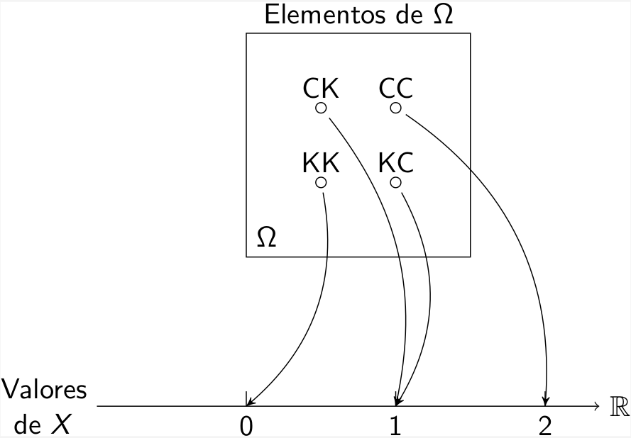

layout: true

<div class="my-footer"></div> 

---
name: indice

```{r setup, include=FALSE,warning=FALSE,message=FALSE}
options(htmltools.dir.version = FALSE)
knitr::opts_chunk$set(
    echo = FALSE,
    message = FALSE,
    warning = FALSE,
    dev = "svg",
    cache = TRUE,
    fig.align = "center"
    #fig.width = 11,
    #fig.height = 5
)

library(dplyr)
library(kableExtra)
library(ggplot2)
```

# Recapitulando

- Fenômeno aleatório: situação ou acontecimento cujos resultados não podem ser previstos com certeza.

- Espaço amostral: conjunto de todos os resultados possíveis de um fenômeno aleatório, denotado por $\Omega$.

- Eventos: subconjuntos de $\Omega$, denotado por A, B, ...

- Conjunto vazio: conjunto sem eventos, denotado por $\emptyset$.

- União $A \cup B$: ocorrência de pelo menos um dos eventos A ou B.

- Intersecção $A \cap B$: ocorrência simultânea de A e B.

- Eventos disjuntos ou mutuamente exclusivos: $A \cap B = \emptyset$.

- Eventos complementares: $A \cup A^c = \Omega$ e $A \cap A^c = \emptyset$.

---
# Variável Aletória

***Variável aleatória*** - Descrição numérica do resultado de um fenômeno aleatório.
--

- X denota a variável aleatória.
- x denota os valores realizados da v.a.
- Probabilidade de X assumir o valor x é denotada $P(X = x )$

--

**Exemplo**

- X: Número de alunos em uma sala de aula.
- Uma possível realização x = 40.

---
# Variável Aleatória Discreta

- Tipos de espaço amostral
1. Espaço amostral Discreto: Contêm apenas um número enumerável de elementos, podendo ser finito ou infinito.

1. Espaço amostral Contínuo: Contêm um número infinito e não enumerável de elementos.

--

Uma função X, definida no espaço amostral $\Omega$ e com valores num conjunto
enumerável de pontos da reta é dita uma ***variável aleatória discreta***.

--

Uma variável aleatória é dicreta se seu espaço amostral é discreto.

--

- Podemos atribuir probabilidades aos eventos deste espaço amostral,
dando origem a idéia de **distribuição de probabilidade**.

- Em geral vamos distinguir a distribuição de probabilidade de v.a’s
discretas e contínuas.

---
# Exemplo de VA Discreta

- Lançamento de duas moedas. Cara: C Coroa: R.

- Espaço amostral do experimento: $\Omega=\{CC; CR; RC; RR\}$

- Variável aleatória: X é o **número de caras** obtidas nas duas moedas.
  + Para cada elemento de $\Omega$ existe uma função $X()$ que associa um valor real aquele elemento
  + $X(CC)=2$, $X(RR)=0$
  
```{r cara-coroa, out.height=250}

```
  
---
# Função de Probabilidade

A ***função de probabilidade (fp)*** da v.a discreta X , que assume os valores
$x_1, x_2,\ldots$, é a função que atribui probabilidades a cada um dos
possíveis valores: $\{(x_i, p_i), i = 1, 2,\ldots\}$, ou seja,

$$P(X = x_i) = p_i ,\qquad i = 1, 2, \ldots$$
com as seguintes propriedades:
1. A probabilidade de cada valor deve estar entre 0 e 1
$$0 \leq p_i \leq 1,\qquad i = 1, 2, \ldots$$
1. A soma de todas as probabilidades é igual a 1

$$\sum_i p_i =1$$

---
# Exemplo

Podemos montar uma tabela de distribuição de frequência para a variável aleatória X = número de resultados cara (C).

```{r cara-coroa-tbl, results='asis'}
df <- data.frame(
    x = c(0, 1, 2),
    freq = c(1, 2, 1),
    freq_rel = c(1/4, 1/2, 1/4)
)

kableExtra::kbl(df, 
                col.names = c("X", "Frequência", "Freq. Relativa")) |> 
    kableExtra::kable_classic(full_width = FALSE)
```

--

Assim podemos associar a cada valor de X sua **probabilidade**
correspondente, como resultado das **frequências relativas**.

- $P(X=1)=0.5$

---
# Exemplo

Dessa forma, a ***distribuição de probabilidade*** da variável aleatória X = número de resultados cara (C) é a tabela:

```{r cara-coroa-dist, results='asis'}
kableExtra::kbl(df[, c(1,3)], 
                col.names = c("X", "Probabilidade")) |> 
    kableExtra::kable_classic(full_width = FALSE)
```

As propriedades da função de probabilidade estão satisfeitas:

- As probabilidades $p_i$ estão entre 0 e 1.
- A soma de todas as probabilidades $p_i$ é 1.

---

# Função de Distribuição de Probabilidade

- Em muitas situações, é útil calcularmos a probabilidade acumulada até um certo valor.
- Definimos a ***função de distribuição*** ou função de distribuição acumulada de uma v.a X pela expressão:

$$F (x ) = P(X \leq x )$$

--

**Exemplo**

.pull-left[
```{r cara-coroa-cdf, results='asis'}
df <- df |> 
    mutate(cdf = cumsum(freq_rel))

kableExtra::kbl(df[, c(1,3, 4)], 
                col.names = c("X", "$P(X=x)$", "$P(X\\leq x)$")) |> 
    kableExtra::kable_classic(full_width = FALSE)
```
]

.pull-right[
```{r cara-coroa-plot, out.height=270}
df2 <- df |> 
    add_row(x = -1, freq = 0, freq_rel = 0, cdf = 0) |> 
    # add_row(x = 3, freq = 0, freq_rel = 0, cdf = 1) |> 
    arrange(x) |> 
    mutate(xend = 0:3)

p <- ggplot(df2, aes(x = x, y = cdf)) +
    geom_segment(aes(xend = xend, yend = cdf)) +
    labs(x = "X",
         y = "F(x)") +
    geom_point(data = df, aes(x = x, y = cdf)) +
    theme_classic()

p
```
]

---

# Função de Distribuição de Probabilidade

Esta função de distribuição do exemplo anterior pode ser assim descrita

$$F(x)=\begin{cases}
0, &\text{se } x < 0\\
0.25, &\text{se } 0\leq x < 1\\
0.75, &\text{se } 1\leq x < 2\\
1, &\text{se } x \geq 2\\
\end{cases}$$

---
# Valor Esperado

- O valor esperado de uma va. discreta é dado pelo seu valor médio

- Dada a v.a. X discreta, assumindo os valores $x_1, \ldots, x_n$, chamamos valor médio ou esperança matemática de X ao valor

$$E[X]=\sum_{i=1}^n x_i\cdot p_i$$

--

**Exemplo**

- Qual o valor esperado de X = número de caras no lançamento de 2 moedas?

--

$E[X]=0\cdot 0.25+ 1\cdot 0.5+2\cdot 0.25=$ `r sum(df$x*df$freq_rel)`

---

# Mediana

A mediana de uma va. discreta é tal que

$$P(X\leq m)\geq 0.5 \text{ e } P(X\geq m)\geq 0.5$$

--

- No nosso exemplo anterior, a mediana será também o valor 1

--

- Esta definição vale para qualquer quantil p

$$P(X\leq q(p))\geq p \text{ e } P(X\geq q(p))\geq 1-p$$

---
# Propriedades do Valor Esperado

Considere a e b duas constantes quaisquer e X uma variável aleatória

- $E[a]=a$

- $E[aX]=aE[X]$

- $E[aX+b]=aE[X]+b$

--

Seja $Z=h(X)$ uma transformação da variável aleatória X. Então, por definição, o valor esperado de Z é

$$E[Z]=\sum h(x_i)\cdot p_i$$

---
# Variância

* Mede a dispersão da massa de probabilidade em torno do valor esperado

* Maior variância, mais "achatada" é a distribuição (sua _função de probabilidade_)

[Variância da Normal](https://dsonnerat.shinyapps.io/shinyProject/)

---
# Variância

- Dada a va. X discreta, assumindo os valores $x_1, \ldots, x_n$, chamamos de variância da va. X o valor

$$Var[X]=\sum_{i=1}^n(x_i-E[X])^2\cdot p_i$$

--

**Exemplo**

- Qual a variância de X = número de caras no lançamento de 2 moedas?

--

$Var[X]=(0 - 1)^2\cdot 0.25+ (1-1)^2\cdot 0.5+(2-1)^2\cdot 0.25=$ `r sum((df$x-1)^2*df$freq_rel)`

---
# Propriedades da Variância

$$Var[X]=E[(X-E[X])^2]$$

--

Podemos expandir e então simplificar esta expressão

$$
\begin{align*}
Var[X]&=E[X^2-2XE[X]+(E[X])^2]\\
&=E[X^2]-2E[X]E[X]+(E[X])^2\\
&=E[X^2]-(E[X])^2
\end{align*}
$$


---
# Propriedades da Variância

Sendo $X$ uma variável aleatória e $a$ e $b$ constantes arbitrárias:

- $Var[X+a]=Var[X]$

- $Var[aX]=a^2Var[X]$

- $Var[aX+b]=a^2Var[X]$

--

`r emo::ji("warning")` Variância **não é** um operador linear!

---
# Variância

## Propriedades

$Var[X+a]=Var[X]$

--


\begin{align*}
E[(X+a)^2]&=E[X^2]+2aE[X]+a^2\\
(E[X+a])^2&=(E[X])^2+2aE[X]+a^2\\
Var[X+a]&=E[X^2]-(E[X])^2\\
&=Var[X]
\end{align*}


---
# Variância

## Propriedades

$Var[aX]=a^2Var[X]$

--


\begin{align*}
E[(aX)^2]&=E[a^2X^2]\\
(E[aX])^2&=(aE[X])^2\\
Var[aX]&=a^2E[X^2]-a^2(E[X])^2\\
&=a^2\left[E[X^2]-(E[X])^2\right]\\
&=a^2Var[X]
\end{align*}

---
# Variância

## Propriedades

$Var[aX+b]=a^2Var[X]$

\begin{align*}
E[(aX+b)^2]&=E[a^2X^2+2abX+b^2]\\
&=a^2E[X^2]+2abE[X]+b^2\tag{1}\\
(E[aX+b])^2&=(aE[X])^2+2abE[X]+b^2\\
&=a^2(E[X])^2+2abE[X]+b^2\tag{2}\\
Var[aX+b]&=(1)-(2)\\
&=a^2E[X^2]-a^2(E[X])^2\\
&=a^2Var[X]
\end{align*}
