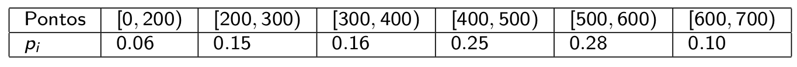

layout: true

<div class="my-footer"></div> 

---
name: indice

```{r setup, include=FALSE,warning=FALSE,message=FALSE}
options(htmltools.dir.version = FALSE)
knitr::opts_chunk$set(
    echo = FALSE,
    message = FALSE,
    warning = FALSE,
    dev = "svg",
    cache = TRUE,
    fig.align = "center"
    #fig.width = 11,
    #fig.height = 5
)

library(dplyr)
library(ggplot2)
library(ggthemes)
library(patchwork)
library(kableExtra)
```


# Índice

- [Uniforme](#uniforme)

- [Bernoulli](#bernoulli)

- [Binomial](#binomial)

- [Geométrica](#geometrica)

- [Poisson](#poisson)

---
name: uniforme
# Distribuição Uniforme

Uma variável aleatória $X$ tem distribuição uniforme discreta se sua **função de probabilidade** é:

$$P(X=x)=1/N, \qquad x=1, \ldots, N$$

--

Notação: $X\sim U_D(1, N)$

---

# Distribuição Uniforme

```{r unif-plots, out.height=540}
N <- c(2, 5, 10, 20)

list_df <- lapply(N, function(n){
    data.frame(x = seq(n), p = 1/n)
    
})

list_plots <- lapply(list_df, function(df){
    ggplot(df, aes(x = x, y = 0)) +
        geom_segment(aes(xend = x, yend = p)) +
        geom_point(aes(x, p), size = 1.5) +
        labs(x = "x", 
             y = "P(X=x)",
             title = sprintf("N=%s", nrow(df))) +
        ylim(c(0, 1)) +
        theme_clean()
})

wrap_plots(list_plots, ncol = 2)
```

---
# Exemplo

Uma rifa tem 100 bilhetes numerados de 1 a 100. Tenho 5 bilhetes
consecutivos numerados de 21 a 25 e meu colega tem outros 5 bilhetes,
com os números 1, 11, 29, 68 e 93. Quem tem maior possibilidade de ser
sorteado?

--

- Ambos tem igual probabilidade de serem sorteados

- Cada bilhete pode ser sorteado com probabilidade igual a 0,01

---
## Valor Esperado


\begin{align*}
E[X]&=\sum_{x=1}^N x P(X=x)\\
&=\frac{1}{N}\sum_{x=1}^N x\\
&=\frac{N+1}{2} \qquad \left(\text{pois, } \sum_{i=1}^k i =\frac{k(k+1)}{2}\right)
\end{align*}


---
# Uniforme

## Variância

\begin{align*}
E[X^2]&=\sum_{x=1}^N x^2 P(X=x)\\
&=\frac{1}{N}\sum_{x=1}^N x^2\\
&=\frac{(N+1)(2N+1)}{6} \qquad \left(\text{pois, } \sum_{i=1}^k i^2=\frac{k(k+1)(2k+1)}{6}\right)
\end{align*}

--

\begin{align*}
Var[X]&=E[X^2]-(E[X])^2 = \frac{(N+1)(2N+1)}{6} - \left(\frac{N+1}{2}\right)^2\\
&=\frac{(N+1)(N-1)}{12}
\end{align*}

---
name: bernoulli
# Bernoulli

Um experimento de Bernoulli é uma variável aleatória discreta com 2, e somente 2, resultados possíveis 0 (fracasso) ou 1 (sucesso). O evento sucesso ocorre com probabilidade $p$.


$$X=\begin{cases}
1 \qquad\text{com probabilidade }p\\
0 \qquad\text{com probabilidade }(1-p)
\end{cases}$$

Notação: $X\sim Ber(p)$

--

$E[X]=\sum_{x=0}^1 x p(x)= 0\cdot (1-p)+1\cdot p = p$

--

$Var[X]=\sum_{x=0}^1 x^2 p(x) - (E[X])^2= 0^2\cdot (1-p)+1^2\cdot p - p^2 = p(1-p)$


---
name: binomial
# Binomial

Se **repetirmos** de forma **independente** $n$ vezes um experimento de **Bernoulli** e contarmos o número de ocorrências de sucesso, teremos então uma variável aleatória discreta com distribuição **Binomial**.

Logo, se $X_i$ é um experimento de Bernoulli, $Y=\sum_{i=1}^n X_i$ terá uma distribuição binomial.

--

A ***função de probabilidade*** é: 

$P(X=x)=\binom{n}{x}p^x(1-p)^{n-x}$, onde $x=0, \ldots, n$.

Onde $\binom{n}{x}=\frac{n!}{x!(n-x)!}$ é o coeficiente binomial

--

Notação: $X\sim B(n,p)$

---
# Binomial

```{r bin-plots, out.height=540}
p <- c(0.2, 0.5, 0.7, 0.9)

list_df <- lapply(p, function(prob){
    data.frame(x = 1:10, p = dbinom(1:10, 10, prob))
    
})

list_plots <- lapply(seq_along(p), function(i){
    ggplot(list_df[[i]], aes(x = x, y = 0)) +
        geom_segment(aes(xend = x, yend = p)) +
        geom_point(aes(x, p), size = 1.5) +
        labs(x = "x", 
             y = "P(X=x)",
             title = sprintf("N=10, p=%s", p[i])) +
        ylim(c(0, 0.45)) +
        theme_clean()
})

wrap_plots(list_plots, ncol = 2)
```

---

# Exemplo

O escore de um teste internacional de proficiência na língua inglesa varia de 0 a 700 pontos, com mais pontos indicando um melhor desempenho. Informações, coletadas durante vários anos, permite estabelecer o seguinte modelo para o desempenho no teste

```{r binomial-exemplo}

```


- Universidades exigem um escore mínimo de 600 pontos para aceitar candidatos de países de língua não inglesa. 

- Escolhemos ao acaso 20 estudantes brasileiros que fizeram o teste. Qual é a probabilidade de exatamente 3 atenderem ao requisito mínimo?

---

# Exemplo
## Solução

- Da tabela temos que a probabilidade de sucesso é $p=0,10$. Logo,

$P(X=3)=\binom{20}{3}p^3(1-p)^{20-3}$

--

```{r binom-exemplo, echo=TRUE}
p <- 0.1
n <- 20
x <- 3

dbinom(x, n, p)
```


---

# Binomial

## Valor Esperado

Sabemos que $x\binom{n}{x}=n\binom{n-1}{x-1}$.


\begin{align*}
E[X]&=\sum_{\color{red}{x=1}}^n x \binom{n}{x}p^x(1-p)^{n-x} &\text{x=0 implica termo=0}\\
&=\sum_{x=1}^n n\binom{n-1}{x-1}p^x(1-p)^{n-x}\\
&=np \underbrace{\sum_{y=0}^{n-1}\binom{n-1}{y}p^y(1-p)^{n-1-y}}_{=1} &\text{y=x-1}\\
&= np
\end{align*}

---
# Binomial

## Variância

Sabemos que $x^2\binom{n}{x}=xn\binom{n-1}{x-1}$


\begin{align*}
E[X^2]&=n\sum_{\color{red}{x=1}}^n x \binom{n-1}{x-1}p^x(1-p)^{n-x}\qquad\qquad\text{x=0 implica termo=0}\\
&=n\sum_{y=0}^{n-1}(y+1)\binom{n-1}{y}p^{y+1}(1-p)^{n-1-y} &\text{y=x-1}\\
&=np\sum_{y=0}^{n-1}y\binom{n-1}{y}p^{y}(1-p)^{n-1-y}+np\sum_{y=0}^{n-1}\binom{n-1}{y}p^{y}(1-p)^{n-1-y}\\
&=n(n-1)p^2+np
\end{align*}

---
# Binomial

## Variância


\begin{align*}
Var[X]&=E[X^2]-(E[X])^2\\
&=n(n-1)p^2+np - n^2p^2\\
&=np(1-p)
\end{align*}

---
# Binomial

## Aproximação com a Normal

[Aproximação Binomial](https://shiny.psy.lmu.de/felix/TK/2/)

* A justificativa formal de tal aproximação é dada pelo chamado **Teorema do Limite Central**, que será visto em Estatística II. 

* A aproximação é boa quando $np > 5$ e $n(1 – p) > 5$.

---
name: geometrica
# Distribuição Geométrica

É uma distribuição também derivada do experimento de Bernoulli. Em uma sequência de **experimentos independentes**, quando ocorre o primeiro sucesso? Sua **função de probabilidade** é

$$P(X=x)=p(1-p)^{x-1},$$
onde $x=1,2,\ldots$ denota a ocorrência do primeiro successo (e.g. na terceira tentativa, $x=3$).

--

Notação: $X\sim G(p)$

--

- Também pode ser parametrizada como o **número de experimentos** até o primeiro sucesso. Neste caso

$$P(X=x)=p(1-p)^{x},\qquad x=0,1,\ldots$$

---
# Distribuição Geométrica

```{r geo-plots, out.height=540}
p <- c(0.1, 0.3, 0.7, 0.9)

list_df <- lapply(p, function(prob){
    data.frame(x = 1:31, p = dgeom(0:30, prob))
    
})

list_plots <- lapply(seq_along(p), function(i){
    ggplot(list_df[[i]], aes(x = x, y = 0)) +
        geom_segment(aes(xend = x, yend = p)) +
        geom_point(aes(x, p), size = 1.5) +
        labs(x = "x", 
             y = "P(X=x)",
             title = sprintf("p=%s", p[i])) +
        # ylim(c(0, 0.9)) +
        theme_clean()
})

wrap_plots(list_plots, ncol = 2)
```

---

# Exemplo

- A probabilidade de se encontrar aberto o sinal de trânsito numa esquina é 0,20. Qual a probabilidade de que seja necessário passar pelo local 5 vezes para então encontrar o sinal aberto pela primeira vez?

--

- Cada "passagem pela esquina" é um experimento com probabilidade de sucesso $p=0,20$

- Passamos 5 vezes com o sinal fechado e na sexta vez, sucesso!! $x=6$

$P(X=6)=p(1-p)^{6-1}= `r 0.2*(0.8)^5`$

---

# Distribuição Geométrica
## Valor Esperado

\begin{align*}
E[X]&=\sum_{x=1}^\infty x p(1-p)^{x-1}\\
&=p\sum_{x=1}^\infty x (1-p)^{x-1}
\end{align*}

--

Definimos então $g(p):=x(1-p)^{x-1}$, e observamos que $g(p)=-\frac{d}{dp}(1-p)^x$. Substituímos na equação acima

---
# Geométrica

## Valor Esperado


\begin{align*}
E[X]&=p\sum_{x=1}^\infty -\frac{d}{dp}(1-p)^x\\
&=-p\frac{d}{dp}\sum_{x=1}^\infty (1-p)^x\\
&=-p\frac{d}{dp}\frac{1-p}{p}\\
&=\frac{-p[-p-(1-p)]}{p^2}\\
&=1/p
\end{align*}

---
# Geométrica

## Variância


\begin{align*}
E[X^2]&=\sum_{x=1}^\infty x^2p(1-p)^{x-1}\\
&=p \sum_{x=1}^\infty [x(x-1) + x](1-p)^{x-1}\\
&=p \sum_{x=1}^\infty x(x-1)q^{x-1} + \underbrace{\sum_{x=1}^\infty x pq^{x-1}}_{=1/p} \qquad\qquad q:=(1-p)\\
&=pq \sum_{x=1}^\infty x(x-1)q^{x-2} + 1/p
\end{align*}


---
# Geométrica

## Variância

Veja que se $g(q)=x(x-1)q^{x-2}$, então $\frac{d^2}{dq^2}q^x = g(q)$.


\begin{align*}
E[X^2]&=pq \sum_{x=1}^\infty \frac{d^2}{dq^2}q^x + 1/p\\
&=pq\frac{d^2}{dq^2}\left(\frac{q}{1-q}\right) + 1/p\\
&=pq\frac{2}{(1-q)^3} + 1/p\\
&=\frac{2-p}{p^2}
\end{align*}

---

# Geométrica

## Variância

Finalmente, temos que:

$Var[X]=E[X^2]-(E[X])^2=\frac{2-p}{p^2}-\frac{1}{p^2}=\frac{1-p}{p^2}$

--

.center[

]

---
name: poisson
# Poisson

É uma distribuição discreta, tipicamente utilizada para modelar um ***processo de contagem*** de ocorrências em um determinado intervalo de tempo ou espaço. 

Exemplo: número de ônibus que passam no ponto da UDESC em 1 minuto¹.

--

A **função de probabilidade** de uma $Poisson(\lambda)$ é:

$$P(X=x)=\frac{e^{-\lambda}\lambda^x}{x!},$$ 
onde $x=0,1, \ldots$ denota a contagem do evento.

--

Notação: $X\sim P(\lambda)$

.footnote[&emsp;&emsp;&emsp;&emsp;&emsp;&emsp;1: Se condicionarmos no fato de estarmos no ponto, o resultado é zero! ]

---

# Poisson

- O parâmetro $\lambda>0$ tem uma interpretação de taxa média de ocorrências no intervalo especificado

- Por exemplo, nº de ônibus que passam na UDESC **por hora** (e.g. 10 ônibus/hora)

--

- `r emo::ji("warning")` Se trocarmos o tamanho do intervalo, deve-se recalcular o valor de $\lambda$

- Por exemplo, em um intervalo de 2 horas irão passar 20 ônibus (e.g. $\lambda$ = 20 ônibus/2 horas)

---

# Poisson

```{r poi-plots, out.height=540}
p <- c(1, 3, 7, 10)

list_df <- lapply(p, function(prob){
    data.frame(x = 0:30, p = dpois(0:30, prob))
    
})

list_plots <- lapply(seq_along(p), function(i){
    ggplot(list_df[[i]], aes(x = x, y = 0)) +
        geom_segment(aes(xend = x, yend = p)) +
        geom_point(aes(x, p), size = 1.5) +
        labs(x = "x", 
             y = "P(X=x)",
             title = sprintf("\u03BB=%s", p[i])) +
        # ylim(c(0, 0.9)) +
        theme_clean()
})

wrap_plots(list_plots, ncol = 2)
```

---

# Exemplo

Suponha que o número de partículas alfa, emitidas por minuto, seja uma variável aleatória seguindo o modelo Poisson com parâmetro 5, isto é, a taxa média de ocorrência é de 5 emissões a cada minuto.

Calcule a probabilidade de haver mais de 2 emissões em um minuto.

--

- $\lambda = 5/min$

- $P(X > 2)=1-P(X\leq 2)$

--

- $P(X=0)= `r dpois(0, 5)`$

- $P(X=1)= `r dpois(1, 5)`$

- $P(X=2)= `r dpois(1, 5)`$

--

- Logo, $P(X > 2)= `r 1-dpois(0, 5)-dpois(1, 5)-dpois(2, 5)`$

---
# Poisson

## Valor Esperado

Sabemos que a expansão em série de Taylor de $e^y=\sum_{i=0}^\infty \frac{y^i}{i!}$.

\begin{align*}
E[X]&=\sum_{x=0}^\infty x\cdot P(X=x)\\
&= \sum_{x=0}^\infty x \frac{e^{-\lambda}\lambda^x}{x!}\\
&= \lambda e^{-\lambda}\sum_{x=1}^\infty \frac{\lambda^{x-1}}{(x-1)!}\\
&= \lambda e^{-\lambda} e^{\lambda}\\
&= \lambda
\end{align*}

---
# Poisson

## Variância


\begin{align*}
E[X^2]&=\sum_{x=0}^\infty x^2\cdot P(X=x)\\
&= \sum_{x=1}^\infty x \frac{e^{-\lambda}\lambda^x}{(x-1)!}\\
&= \lambda e^{-\lambda}\sum_{y=0}^\infty (y+1)\frac{\lambda^{y}}{y!}\\
&= \lambda \underbrace{\sum_{y=0}^\infty y e^{-\lambda}\frac{\lambda^{y}}{y!}}_{=\lambda} + \lambda e^{-\lambda}\underbrace{\sum_{y=0}^\infty \frac{\lambda^{y}}{y!}}_{=e^\lambda}\\
&= \lambda^2 + \lambda
\end{align*}

---
# Poisson

## Variância

$Var[X]=E[X^2]-(E[X])^2=\lambda^2 + \lambda - \lambda^2= \lambda$