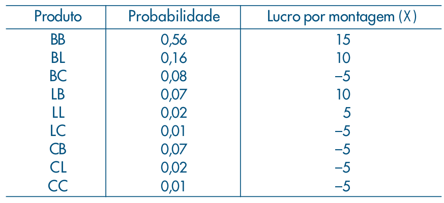

layout: true

<div class="my-footer"></div> 

---
name: indice

```{r setup, include=FALSE,warning=FALSE,message=FALSE}
options(htmltools.dir.version = FALSE)
knitr::opts_chunk$set(
    echo = FALSE,
    message = FALSE,
    warning = FALSE,
    dev = "svg",
    cache = TRUE,
    fig.align = "center"
    #fig.width = 11,
    #fig.height = 5
)

library(gt)
library(dplyr)
library(kableExtra)

```


# Índice

- [VA Discretas](#discretas)

- [Uniforme](#uniforme)

- [Bernoulli](#bernoulli)

- [Binomial](#binomial)

- [Geométrica](#geometrica)

- [Poisson](#poisson)

---
name: discretas

# Valor Esperado e Variância

## Exercícios

Considere a seguinte distribuição dos lucros de uma montadora por produto vendido:

```{r, fig.align='center', out.width="500"}

```

a) Calcule o valor esperado do lucro

b) Calcule a variância deste lucro

---
# Valor Esperado e Variância

## Exercícios

```{r montadora, echo=FALSE}
df <- data.frame(
    prob = c(0.56, 0.16, 0.08, 0.07, 0.02, 0.01, 0.07, 0.02, 0.01),
    lucro = c(15, 10, -5, 10, 5, -5, -5, -5, -5)
)

df_group <- df |> 
    group_by(lucro) |> 
    summarize(prob = sum(prob))

media <- df_group |> 
    summarize(sum(lucro * prob)) |> 
    pull()

variancia <- df_group |> 
    summarise(sum((lucro - media)^2 * prob)) |> 
    pull()

variancia2 <- df_group |> 
    summarise(sum(lucro^2 * prob) - media^2) |> 
    pull()
```

Facilitamos nossos cálculos produzindo a seguinte tabela de probabilidades:

```{r, echo=FALSE, results='asis'}
kableExtra::kbl(df_group,
                col.names = c("Lucro", "Probabilidade"))
```

--

$E[X]=\sum_{x\in\chi}xp(x)=-5*0.19+5*0.02+10*0.23+15*0.56=$ `r media`

---
# Valor Esperado e Variância

## Exercícios


$$
\begin{align*}
V[X]&=\sum_{x\in\chi}(x-\bar{x})^2p(x)\\
&=(-5 - 9.85)^2*0.19 + (5 - 9.85)^2 * 0.02 + (10-9.85)^2 * 0.23+(15-9.85)^2 * 0.56\\
&\approx 57.23
\end{align*}
$$

--

**OU**

$$
\begin{align*}
V[X]&=\sum_{x\in\chi}x^2p(x) - \bar{x}^2\\
&=(-5)^2*0.19 + (5)^2 * 0.02 + (10)^2 * 0.23+(15)^2 * 0.56 - 9.85^2\\
&\approx 57.23
\end{align*}
$$


---
# Valor Esperado e Variância

## Exercícios

Suponha duas variáveis aleatórias $X$ e $Y$ com as seguintes funções de probabilidade:

$P(X=5)=P(X=15)=0,25$ e $P(X=10) = 0,50$. $P(Y=8)=P(Y=12)=0,25$ e $P(Y=10)=0,5$.

Qual será o valor esperado de $X$ e $Y$?

--

$E[X]=\sum_{x\in\chi}xp(x)=5*0.25 + 10*0.5 + 15*0.25 =$ `r 5*0.25 + 10*0.5 + 15*0.25`

$E[Y]=\sum_{y\in\Upsilon}yp(y)=8*0.25+10*0.5+12*0.25=$ `r 8*0.25+10*0.5+12*0.25`

--

$Var[X]=\sum_{x\in\chi}(x-\bar{x})^2 p(x)=$ `r (5^2*0.25 + 10^2*0.5 + 15^2*0.25)-(5*0.25 + 10*0.5 + 15*0.25)^2`

$Var[Y]=\sum_{y\in\Upsilon}(y-\bar{y})^2 p(y)=$ `r (8^2*0.25+10^2*0.5+12^2*0.25)-(8*0.25+10*0.5+12*0.25)^2`

---
# Valor Esperado e Variância

## Exercícios

A variável aleatória discreta $X$ assume apenas os valores $0, 1, 2, 3, 4 \text{ e } 5$. A função de probabilidade de $X$ é dada por: 

$$
\begin{align*}
P(X = 0)&=P(X=1)=P(X=2)=P(X=3)=a\\
P(X=4) &= P(X = 5)=b\\
P(X\geq 2) &= 3P(X < 2)
\end{align*}
$$
$E[ \cdot ]$ e $V[ \cdot ]$ denotam, respectivamente, esperança e variância. Julgue as seguintes afirmativas:

1. $E[X]=3$
1. $V[X]=12$

---
# Valor Esperado e Variância

## Exercícios

Resolvemos o sistema:

$$\begin{cases}
4a+2b=1\\
2a+2b=3(2a)
\end{cases}$$

```{r, echo=FALSE}
A <- matrix(c(4, 2, -4, 2), ncol = 2, byrow = TRUE)
B <- c(1, 0)
s <- solve(A, B)
a <- s[1]
b <- s[2]
```
--

Temos $b=1/4$ e $a=1/8$. 

--

$E[X]=0*a+1*a+2*a+3*a+4*b+5*b=$ `r 0*a+1*a+2*a+3*a+4*b+5*b`

$V[X]=0^2*a+1^2*a+2^2*a+3^2*a+4^2*b+5^2*b - (E[X])^2=$ `r 0^2*a+1^2*a+2^2*a+3^2*a+4^2*b+5^2*b - (0*a+1*a+2*a+3*a+4*b+5*b)^2`

---

# Valor Esperado e Variância

## Exercícios

.left-wide[
Uma população de 1000 crianças foi analisada num estudo para determinar a efetividade de uma vacina contra um tipo de alergia.

No estudo, as crianças recebiam uma dose da vacina e, após um mês, passavam por um novo teste. Caso ainda tivessem tido alguma reação alérgica, recebiam outra dose da vacina. Ao fim de 5 doses todas as crianças foram consideradas imunizadas.

Os resultados estão na tabela a seguir.
]

--

.right-thin[

```{r vacinas, results='asis'}
df <- data.frame(
    doses = 1:5,
    freq = c(245, 288, 256, 145, 66)
)

kbl(df, col.names = c("Doses", "Freq.")) |> 
    kable_classic(full_width = FALSE)
```

]

---
# Variância

## Exercícios

a) Encontre a função de probabilidades, _fp_

b) Encontre a função de distribuição acumulada, _FDA_

c) Qual a probabilidade de uma criança ter recebido 2 doses?

d) Qual a probabilidade de uma criança receber menos de 4 doses?

e) Qual o valor esperado do número de doses de vacina deste estudo?

f) Qual a variância do número de doses?

g) Qual a probabilidade de uma criança receber mais de 5 doses?

---

# Valor Esperado e Variância

## Exercícios


Considere uma v.a. discreta $X$ e uma transformação $g(X) = \sqrt{X}$ desta v.a. que possui a seguinte distribuição:


```{r jensen, results='asis'}
df <- data.frame(
    X = 2*(1:4),
    prob = c(0.2, 0.25, 0.3, 0.25)
)

kbl(df, col.names = c("X", "Prob.")) |> 
    kable_classic(full_width = FALSE)
```


---

# Valor Esperado e Variância

## Exercícios

.pull-left[
a) Calcule o valor esperado de $X$ e $Z=g(X)$


```{r, results='asis'}
df <- df |> 
    mutate(Z = sqrt(X))

kbl(df, col.names = c("X", "Prob.", "Z")) |> 
    kable_classic(full_width = FALSE)
```
]

--

.pull-right[
* $E[X]=$ `r sum(df$X*df$prob)` 

* $g(E[X])=$ `r sqrt(sum(df$X*df$prob))`

* $E[Z]=$ `r sum(df$Z*df$prob)`

* Esta é uma aplicação da [**desigualdade de Jensen**](https://pt.wikipedia.org/wiki/Desigualdade_de_Jensen)

* $E[g(X)]\leq g(E[X])$ sempre que $g(X)$ for côncava

* A relação é trocada para $g(X)$ convexa
]

---
# VA Discretas

```{r q2-probs, echo=FALSE}
# Probabilidades dos branches
p_b1 <- 1/3
p_b2 <- 2/3
# Probabilidades de vender
p_v <- 3/10
p_nv <- 7/10
```

Uma economia pode entrar em recessão com probabilidade de `r vec_fmt_fraction(p_b1)` ou continuar em crescimento econômico com probabilidade `r vec_fmt_fraction(p_b2)`. Quando em recessão, 10 milhões de empregos podem ser destruídos com probabilidade `r vec_fmt_fraction(p_v, accuracy = 10)` ou nenhum emprego é perdido. Se em crescimento econômico, esta economia pode continuar gerando 5 milhões de empregos com probabilidade `r vec_fmt_fraction(p_v, accuracy = 10)`, ou acelerar e produzir 10 milhões de empregos.

Denotando por $Y$ o número de empregos gerados (ou destruídos) desta economia:

a) Escreva (em formato de tabela) a função de densidade de probabilidade de $Y$. 

b) Calcule a função de distribuição acumulada de $Y$. 

c) Calcule o valor esperado de empregos que serão criados ou destruídos.

---

# VA Discretas

## Solução

A partir da árvore de probabilidades, podemos construir a seguinte tabela de probabilidades:

a)

```{r , results='asis'}
df <- data.frame(
    Empregos = c(-5, 0, 5, 10),
    Prob = c(p_b1*p_v,
             p_b1*p_nv,
             p_b2*p_v,
             p_b2*p_nv)
)

df |> 
    gt() #|>
    # fmt_fraction(columns = "Prob", simplify = FALSE, accuracy = 100)
```

---

# VA Discretas

## Solução

b)

```{r, results='asis'}
df <- df |> 
    mutate(FDA = cumsum(Prob))
df |> 
    gt()
```

---

# VA Discretas

## Solução

c) O valor esperado para os empregos é $\sum_{x}xp(x)$, logo:

$E[Y]=$ `r sum(df$Empregos * df$Prob)` milhões de empregos são esperados de serem criados.

---
name: uniforme

# Uniforme

Suponha que $X$ seja uniformemente distribuída no intervalo [0, b], com
$b \in \mathbb{N}$. 

a) Derive a fórmula do valor esperado de $X$

Calcule qual deve ser o valor de b para satisfazer as seguintes
condições:

b) $P(X > 1) = 1/(b+1)$

c) $E[X] = k$, onde k é uma constante inteira maior que 0

---

# Uniforme

## Solução

a)

$$
\begin{align*}
E[X]&=\sum_{x=0}^b x \frac{1}{b+1}\\
&=\frac{1}{b+1}\sum_{x=1}^b x\\
&=\frac{1}{b+1}\frac{b(b+1)}{2}\\
&=b/2
\end{align*}
$$

---

# Uniforme

## Solução

b) $P(X > 1) = 1/(b+1)$

$$
\begin{align*}
P(X > 1) &= 1 - P(X=0) - P(X=1)\\
\frac{1}{b+1} &= 1-2\frac{1}{b+1}\\
\frac{1}{b+1} &= \frac{b-1}{b+1}\\
b &= 2
\end{align*}
$$

---

# Uniforme

## Solução

c) $E[X] = k$

$$
\begin{align*}
E[X]&=b/2\\
b/2&=k\\
b&=2k
\end{align*}
$$

---
name: bernoulli

# Bernoulli

Sabendo que a função geradora de momentos (fgm) de uma distribuição $X$ é dada por $M_X(t)=E[e^{tX}]$, calcule:

a) a _fgm_ de uma Bernoulli

b) o valor esperado

c) a variância

---

# Bernoulli

## Solução

a)

$$
\begin{align*}
M_X(t)&=\sum_{k\in\{0,1\}} e^{tk}p^k(1-p)^{1-k}\\
&=(1-p)+pe^t
\end{align*}
$$

---

# Bernoulli

## Solução

b) $E[X]=M_X'(0)$. Logo:

$M_X'(t)=pe^t\implies M_X'(0)=p$

c) $E[X^2]=M_X''(0)$.

$M_X''(t)=pe^t\implies M_X''(0)=p$. Porém $Var[X]=E[X^2]-(E[X])^2$,

$Var[X]=p-p^2=p(1-p)$

---
name: binomial

# Binomial

Suponha que se realizam 10 lançamentos independentes de uma moeda. Determine a função de probabilidade do número de caras obtidas e calcule a probabilidade de obtermos pelo menos duas caras.

---

# Binomial

## Solução

Podemos modelar esse problema como uma distribuição binomial com $p = 0,5$ e $n = 10$. Logo, seja $X\sim B(10; 0,5)$, queremos encontrar a probabilidade de obtermos ao menos duas caras, que é o mesmo que procurarmos o complementar de obtermos menos de duas caras, ou seja: $P(X \geq 2) = 1 − P(X < 2)$. Como $P(X < 2) = P(X = 1) + P(X = 0)$, então:

$P(X \geq 2) = 1 − P(X < 2) = 1 − P(X = 1) − P(X = 0) =$ `r 1-sum(dbinom(0:1, 10, 0.5))`

Sendo que $P(X=k)=\binom{n}{k} p^k(1-p)^{n-k}$

---
name: geometrica

# Geométrica

Considere um indivíduo procurando emprego. Para cada entrevista de emprego $(X)$ esse indivíduo tem um custo linear $(C)$ de 10,00 reais. Suponha que a probabilidade de sucesso em uma entrevista qualquer seja de 0,2 . Suponha também que as entrevistas sejam independentes, e que o indivíduo continue fazendo entrevistas até que tenha o primeiro resultado de sucesso. Calcule o custo esperado até alcançar o primeiro sucesso.

---

# Geométrica

## Solução

Note que aqui temos um problema que pode ser representado por uma distribuição **geométrica** com probabilidade de sucesso igual a 0,2. 

--
Assim, queremos saber qual o ***valor esperado do número de entrevistas***, para assim calcularmos nosso custo. Isso é dado pela esperança de uma geométrica com probabilidade 0,2, que é $1/p = 5$. 

--
Como o custo de cada entrevista é igual a 10 reais, o custo esperado até alcançar o primeiro sucesso é de 50 reais.

---
name: poisson

# Poisson


Numa central telefônica, o número de chamadas chega segundo uma distribuição de
Poisson, com a média de oito chamadas por minuto. Determinar qual a probabilidade
de que num minuto se tenha:

a) dez ou mais chamadas

b) menos que nove chamadas

c) entre sete (inclusive) e nove (exclusive) chamadas

---

# Poisson

## Solução

Neste caso $\lambda = 8/min$ e $P(X=k)=\frac{e^{-\lambda}\lambda^k}{k!}$

a) $P(X\geq 10)=1-P(X<10)=$ `r 1-ppois(9, 8, lower.tail=TRUE)` 

b) $P(X<9)=$ `r ppois(8, 8, lower.tail=TRUE)`

c) $P(X\in\left[7, 9\right))=P(X=7)+P(X=8)=$ `r dpois(7, 8)-dpois(6, 8)`