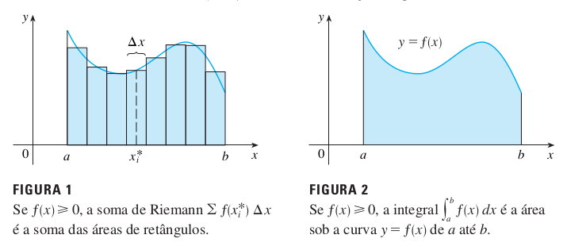

layout: true

<div class="my-footer"></div> 

---

```{r setup, include=FALSE,warning=FALSE,message=FALSE}
options(htmltools.dir.version = FALSE)
knitr::opts_chunk$set(
    echo = FALSE,
    message = FALSE,
    warning = FALSE,
    dev = "svg",
    cache = TRUE,
    fig.align = "center"
    #fig.width = 11,
    #fig.height = 5
)

```

# Soma de Riemann

.pull-left[

* $\sum_{i=1}^n f(x_i^*)\Delta x$ é conhecida como a **soma de Riemann**

* Integral pode ser definida em termos desta soma

$$\int_a^b f(x)\,dx=\lim_{n\rightarrow\infty}\sum_{i=1}^n f(x_i^*)\,\Delta x$$

]

--

.pull-right[
```{r}

```
]

--

<br>
<br>
.center[`r emo::ji("warning")` ***A integral herda as propriedades de um somatório***]

---

# Propriedades da Integral Definida

* $\int_a^b f(x)\,dx=-\int_b^a f(x)\,dx$

* $\int_a^a f(x)\,dx=0$

* $\int_a^b c \,dx=c(b-a)$

* $\int_a^b cf(x)\,dx=c\int_a^b f(x)\,dx$

* $\int_a^b [f(x) + g(x)]\,dx=\int_a^b f(x)\,dx + \int_a^b g(x)\,dx$

* $\int_a^c f(x)\,dx + \int_c^b f(x)\,dx=\int_a^b f(x)\,dx$

---
# Propriedades Comparativas

* Se $f(x)\geq 0$ para $a\leq x \leq b$, então $\int_a^b f(x) \, dx \geq 0$

* Se $f(x)\geq g(x)$ para $a\leq x \leq b$, então $\int_a^b f(x) \, dx \geq \int_a^b g(x)\, dx$

* Se $m\leq f(x) \leq M$ para $a\leq x \leq b$, então $m(b-a)\leq \int_a^b f(x) \, dx \leq M(b-a)$

---
# Teorema Fundamental do Cálculo

## O Teorema Fundamental do Cálculo, Parte 1

<rect-block> 
Se $f$ for contínua em $\left[a, b\right]$, então a função $g$ definida por
$$g(x)=\int_a^x f(t)\,dt, \qquad a\leq x \leq b$$
é contínua em $\left[a, b\right]$, diferenciável em $\left(a, b\right)$ e $g'(x)=f(x)$.

</rect-block>

---
# Teorema Fundamental do Cálculo

## O Teorema Fundamental do Cálculo, Parte 2

<rect-block>
Se $f$ for contínua em $\left[a, b\right]$, então
$$\int_a^b f(x)\,dx=F(b)-F(a)$$
onde $F$ é qualquer primitiva de $f$, ou seja, $F'=f$.

</rect-block>

---

# Integral Indefinida

$$\int f(x)\,dx=F(x)+C \implies F'(x)=f(x)$$

**Tabela de Integrais**

.pull-left[
$\int cf(x)\,dx=c\int f(x)\,dx$

$\int x^n\,dx=\frac{x^{n+1}}{n+1}+C \quad(n\neq 1)$

$\int e^x\,dx = e^x+C$
]

.pull-right[
$\int k\,dx=kx + C$

$\int a^x\,dx=\frac{a^x}{\log a}+C$

$\int 1/x\,dx = \log |x|+C$
]

---
# Exemplos

Calcule:

a) $\int x^2\,dx$

b) $\int 10x^4+e^x\,dx$

c) $\int (x^3 - 6x + 1/x) \,dx$

d) $\int (\sqrt{x^3}+\sqrt[3]{x^2})\,dx$

---

# Técnicas de Integração

## Regra da Substituição

<rect-block>
Se $u=g(x)$ for uma função diferenciável cuja imagem é um intervalo $I$ e $f$ for contínua em $I$, então
$$\int f(g(x))g'(x)\,dx=\int f(u)\,du$$

</rect-block>

--
<br>
<br>
$u=g(x)\implies \frac{du}{dx}=g'(x)$. Logo, $du=g'(x)\, dx$

---
# Exemplos

Calcule:

a) $\int \frac{x}{\sqrt{1-4x^2}}\,dx$

b) $\int e^{5x}\,dx$

c) $\int \sqrt{1+x^2}\,x^5\,dx$

d) $\int_1^3 \frac{1}{(3-5x)^2}\,dx$

---
# Técnicas de Integração

## Integração por Partes

$$\int f(x)g'(x)\,dx = f(x)g(x)-\int g(x)f'(x)\,dx$$

--

Podemos simplificar a notação: $u=f(x)$ e $dv=g'(x)\,dx$.

--

$$\int u\,dv=uv-\int v\,du$$

---
# Exemplos

Calcule:

a) $\int \log x\, dx$

b) $\int t^2e^t\,dt$

c) $\int x\log(1+x)\,dx$
